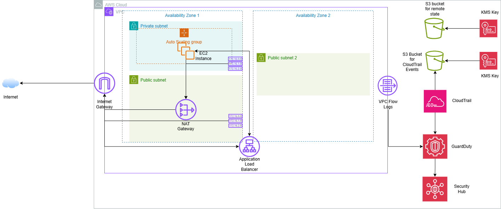

# aws-cloud-security-terraform
Secure AWS Infrastructure built with Terraform. Security-focused architecture with intentional misconfigurations to show vulnerability detection and remediation
This project provisions a secure, scalable AWS infrastructure using Terraform. The architecture includes a VPC with one private subnet containing an EC2 instance attached to an Auto Scaling Group, and two public subnets across two Availability Zones hosting an Application Load Balancer. KMS-encrypted S3 buckets store CloudTrail audit events and Terraform remote state. GuardDuty provides threat detection and Security Hub enforces CIS and PCI-DSS compliance standards. A GitHub Actions CI/CD pipeline runs Checkov and tfsec security scans on every push, catching misconfigurations before deployment. The insecure-config branch intentionally introduces five security findings to demonstrate vulnerability identification, with the main branch showing full remediation.
## Architecture Diagram

## Security Features

- KMS customer-managed keys encrypting S3 buckets and CloudWatch Log Groups
- CloudTrail enabled across all regions with log file validation and KMS encryption
- GuardDuty threat detection with S3 protection and EBS malware scanning enabled
- Security Hub with CIS Foundations Benchmark and PCI-DSS standards
- VPC Flow Logs capturing all traffic, encrypted and retained for 365 days
- IMDSv2 enforced on all EC2 instances (no IMDSv1)
- ALB deletion protection enabled
- S3 buckets versioned with public access fully blocked
- Default VPC security group restricted with no open rules
- Least-privilege IAM roles for all service integrations

## Intentional Misconfigurations (insecure-config branch)

The following findings are deliberately introduced to demonstrate vulnerability 
identification using Checkov. These are remediated in the `main` branch.

| Finding | Resource | Risk |
|--------|----------|------|
| CKV_AWS_2 | aws_lb_listener | ALB listener uses HTTP instead of HTTPS, exposing traffic to interception |
| CKV2_AWS_20 | aws_lb | No HTTP to HTTPS redirect, allowing unencrypted sessions |
| CKV_AWS_103 | aws_lb_listener | No TLS 1.2 minimum enforced, vulnerable to downgrade attacks |
| CKV_AWS_378 | aws_lb_target_group | Target group using HTTP, unencrypted backend traffic |
| CKV_AWS_260 | aws_vpc_security_group_ingress_rule | Security group allows ingress on port 80 from any CIDR |
| CKV_AWS_91 | ALB access logging bucket policy conflict | disabled pending resolution on main branch |

## Prerequisites

- Terraform >= 1.0
- AWS CLI configured with appropriate permissions
- An S3 bucket for remote state (update `backend.tf` with your bucket name)
- An AWS account with GuardDuty and Security Hub not previously enabled

## Deploy Steps

### 1. Clone the repository
```bash
git clone https://github.com/Jason2303/aws-cloud-security-terraform.git
cd aws-cloud-security-terraform
```

### 2. Initialise Terraform
```bash
terraform init
```

### 3. Review the plan
```bash
terraform plan
```

### 4. Apply the infrastructure
```bash
terraform apply
```

### 5. Destroy when done
```bash
terraform destroy
```

> ⚠️ Enabling Security Hub and GuardDuty will incur AWS costs. 
> Destroy the stack when not in use.

## Tools Used

| Tool | Purpose |
|------|---------|
| Terraform | Infrastructure as Code — provisioning all AWS resources |
| Checkov | Static analysis security scanning of Terraform code |
| tfsec | Secondary IaC security scanner for additional coverage |
| GitHub Actions | CI/CD pipeline running security scans on every push |
| draw.io | Architecture diagram design |
| AWS KMS | Customer-managed encryption keys |
| AWS GuardDuty | Threat detection and monitoring |
| AWS Security Hub | Compliance aggregation (CIS + PCI-DSS) |
| AWS CloudTrail | API audit logging across all regions |
